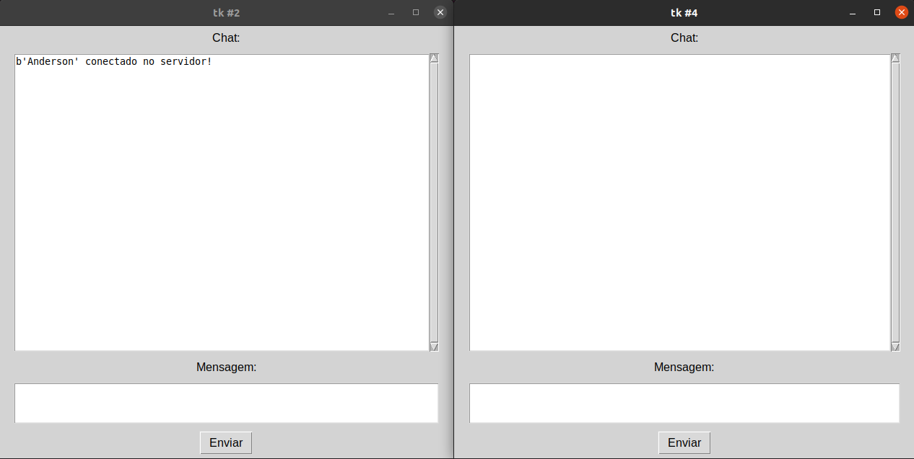

# Chat Python

Sistema de chat simples elaborado em Python com a utilização de sockets, threads e interface gráfica.

### Demo

## Sobre o Chat Python

Sistema de chat simples (TCP/IP) elaborado em Python com a utilização de sockets, threads e interface gráfica.

Trabalho elaborado na disciplina de Projeto Integrador - Programação em Redes.

O sistema foi desenvolvido na linguagem de programação Python (versão 3.8.5) e a interface gráfica foi elaborada utilizando a biblioteca Tkinter.

Para executar o sistema com múltiplos usuários, você deve seguir as intruções abaixo:

1. Executar o servidor primeiro.
2. Executar os clients depois.
3. Fazer os passos 1 e 2 em terminais diferentes.

Observação: o chat funciona com mais de dois usuários.
